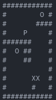

# My_Sokoban 📦

Welcome to **my_sokoban**.

A project focused on developing a terminal-based version of the classic Sokoban game.

This project challenges you to recreate this puzzle game using the `ncurses` library.

## Language and Tools 🛠️

- **Language:** C
- **Compilation:** Via Makefile, including `re`, `clean`, and `fclean` rules.
- **Library:** `ncurses` for terminal graphics.

## Game Overview 🎮

Sokoban, Japanese for `warehouse keeper`, is a transport puzzle where the player pushes boxes around in a warehouse, aiming to get them to designated storage locations. The game is played on a grid of squares with walls, floors, boxes, and storage locations.

### How to Play

- **Movement:** Use arrow keys (LEFT, RIGHT, UP, DOWN) to move the player around the warehouse.
- **Objective:** Push all boxes (`X`) onto the storage locations (`O`).
- **Rules:**
  - The player (`P`) can move horizontally or vertically onto empty squares.
  - The player can push a box into an adjacent empty square.
  - Boxes cannot be pushed into other boxes, walls, or pulled.
- **Winning Condition:** The game is won when all boxes are on storage locations.
- **Losing Condition:** The game is lost if none of the boxes can be moved anymore.
- **Restarting the Game:** Press the space bar to reset the game.
- **Terminal Size:** The game adapts to the terminal size. If the terminal is too small, a message prompts the user to enlarge it.

### Map Specifications

- A valid map contains only the characters: SPACE, `\n`, `#`, `X`, `O`, and `P`.
- If an invalid map is supplied, the program exits with an error.

### Core Features

- Sokoban game mechanics implemented in a terminal environment.
- ncurses library for managing game graphics and input.

## Preview 📸

## Installation and Usage 💾

1. Clone the repository.
2. Compile the game using the provided Makefile.
3. Run the program: `./my_sokoban [map]`.
4. For detailed guidelines, refer to `my_sokoban.pdf`.

## License ⚖️

This project is released under the MIT License. See `LICENSE` for more details.
